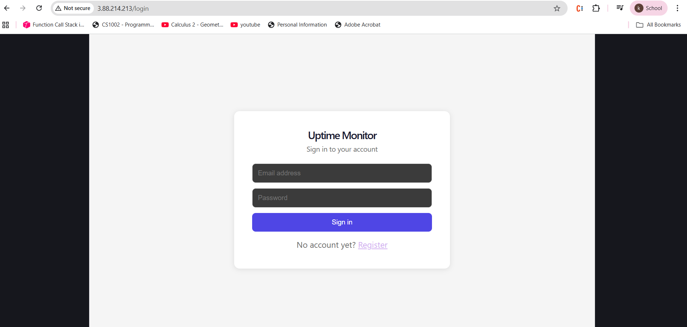
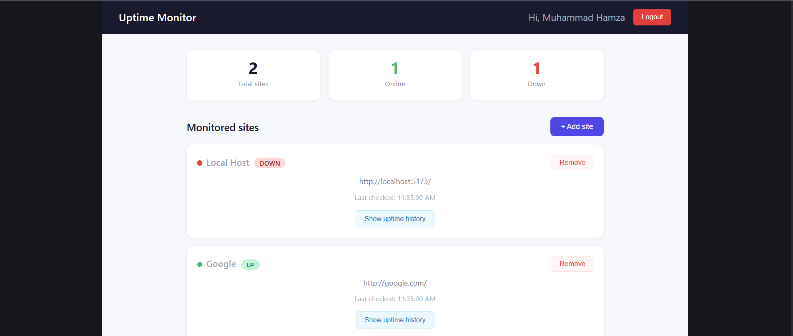
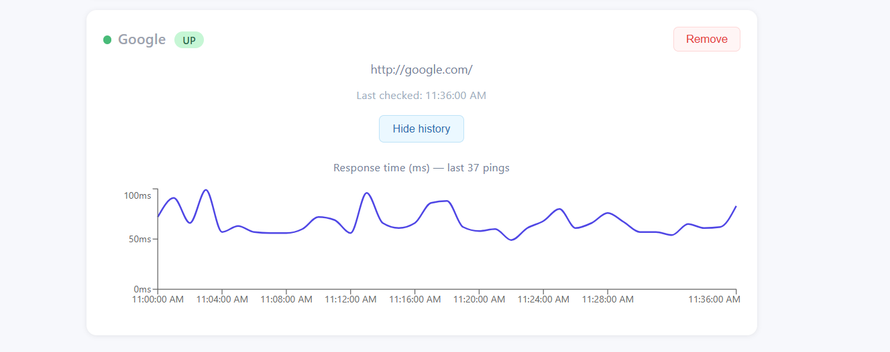

# Uptime Monitor

A self-hosted website uptime monitoring system built with the MERN stack, Redis caching, BullMQ background workers, Docker containerization, and a fully automated CI/CD pipeline to AWS EC2.

**Live demo:** http://3.88.214.213

---

## What it does

Register any website URL and the system will:

- Ping it every **60 seconds** and record its HTTP status code and response time
- Cache its current status (`UP` / `DOWN`) in Redis for instant dashboard loads
- Store full ping history in MongoDB to power uptime/response-time charts
- **Automatically email the site owner** the moment a site goes from UP → DOWN (or is found DOWN on its very first check)
- Periodically clean up old ping logs to keep the database lean

This was built to solve a real problem: detecting and reporting server downtime before clients or QA teams notice it manually.

---

## Screenshots

| Login | Dashboard | Uptime history |
|---|---|---|
|  |  |  |

---

## Architecture

```
                 ┌────────────────────────┐
                 │   React frontend        │
                 │   (browser)              │
                 └────────────┬─────────────┘
                              │
                 ┌────────────▼─────────────┐
                 │          Nginx            │
                 │   reverse proxy · :80     │
                 └──────┬─────────────┬──────┘
                        │             │
            ┌───────────▼───┐   ┌─────▼───────────────┐
            │  Express API   │──▶│   BullMQ worker      │
            │  JWT · CRUD    │   │ ping job · alert job │
            │  rate limit    │   │ log cleanup job      │
            └──────┬─────────┘   └─────┬─────────┬─────┘
                   │                    │         │
            ┌──────▼────────┐   ┌───────▼──┐  ┌───▼─────────┐
            │     Redis      │◀──┘          │  │   MongoDB    │
            │ status cache   │              │  │ users/sites  │
            │ rate limiter   │              │  │ ping logs    │
            │ BullMQ queue   │              │  └──────────────┘
            └────────────────┘
```

All five services (frontend, backend, Nginx, Redis, MongoDB) run as Docker containers on a single AWS EC2 instance, orchestrated by `docker-compose.yml`.

A full architecture diagram, component breakdown, BullMQ job-flow diagram, and CI/CD pipeline diagram are available in [`docs/Uptime_Monitor_Project_Documentation.docx`](docs/Uptime_Monitor_Project_Documentation.docx).

---

## Tech stack

| Layer | Technologies |
|---|---|
| Frontend | React 19, TypeScript, Vite, React Router 7, Recharts, Axios |
| Backend | Node.js, Express, TypeScript, Mongoose, JWT, bcrypt |
| Background processing | BullMQ, ioredis |
| Caching / queue store | Redis 7 |
| Database | MongoDB 6 |
| Reverse proxy | Nginx (alpine) |
| Containerization | Docker, Docker Compose |
| Cloud hosting | AWS EC2 (Ubuntu, t3.micro) |
| CI/CD | GitHub Actions |

---

## Project structure

```
uptime-monitor/
├── .github/
│   └── workflows/
│       └── deploy.yml          # CI/CD pipeline (build, test, deploy to EC2)
├── backend/
│   ├── src/
│   │   ├── config/             # MongoDB & Redis connections
│   │   ├── middleware/         # JWT auth, Redis rate limiter
│   │   ├── models/              # User, Site, PingLog (Mongoose schemas)
│   │   ├── queues/               # BullMQ queue definitions
│   │   ├── routes/               # /api/auth, /api/sites
│   │   ├── workers/              # ping worker, alert worker, log cleanup
│   │   └── index.ts
│   └── Dockerfile
├── frontend/
│   ├── src/
│   │   ├── api/                  # Axios instance
│   │   ├── components/           # Navbar, SiteCard, AddSiteModal, UptimeChart
│   │   ├── context/              # AuthContext (JWT state)
│   │   └── pages/                # Login, Register, Dashboard
│   └── Dockerfile
├── docker-compose.yml            # Production stack (5 services)
├── docker-compose.dev.yml        # Local dev: Mongo + Redis only
├── nginx.conf                    # Reverse proxy config
└── .env                          # Secrets (gitignored)
```

---

## Running locally

### Prerequisites

- Node.js 20+
- Docker Desktop

### 1. Clone the repo

```bash
git clone https://github.com/fasihfast/uptime-monitor.git
cd uptime-monitor
```

### 2. Start MongoDB and Redis (Docker)

```bash
docker compose -f docker-compose.dev.yml up -d
```

### 3. Configure backend environment

Create `backend/.env`:

```env
PORT=5000
NODE_ENV=development
MONGO_URI=mongodb://localhost:27017/uptime-monitor
REDIS_HOST=localhost
REDIS_PORT=6379
JWT_SECRET=your_super_secret_key_change_this_in_production
EMAIL_USER=youremail@gmail.com
EMAIL_PASS=your_gmail_app_password_no_spaces
```

> `EMAIL_PASS` must be a [Gmail App Password](https://myaccount.google.com/apppasswords), not your regular Gmail password, with all spaces removed.

### 4. Run the backend

```bash
cd backend
npm install
npm run dev
```

You should see:

```
Redis connected successfully
MongoDB connected successfully
Server running on port 5000
Ping worker listening on ping-queue
Alert worker listening on alert-queue
```

### 5. Run the frontend

```bash
cd frontend
npm install
npm run dev
```

Open **http://localhost:5173** — register an account, log in, and add a site to monitor.

---

## Running with Docker Compose (full stack)

This is how the app runs in production on EC2.

### 1. Create the root `.env`

```env
JWT_SECRET=your_super_secret_key_change_this_in_production
EMAIL_USER=youremail@gmail.com
EMAIL_PASS=your_gmail_app_password_no_spaces
```

### 2. Build and start everything

```bash
docker compose up -d --build
```

This builds and starts 5 containers: `nginx`, `backend`, `frontend`, `redis`, `mongo`.

### 3. Open the app

```
http://localhost
```

Nginx serves the React frontend on `/` and proxies `/api/*` to the Express backend — both on port **80**.

### Useful commands

```bash
docker ps                          # check all containers are "Up"
docker compose logs backend -f     # follow backend logs
docker compose restart nginx       # restart nginx (e.g. after rebuilding other services)
docker compose down                # stop everything
```

---

## How it works under the hood

### Authentication

JWT-based auth. Passwords are hashed with bcrypt before being stored. Every `/api/sites/*` route is protected by a `protect` middleware that verifies the token and attaches the user to the request.

### Monitoring loop (BullMQ + Redis)

1. When a site is added, a **repeating BullMQ job** is scheduled on `ping-queue` with a unique `jobId` (`ping-{siteId}`) and a 60-second interval.
2. The **ping worker** performs an HTTP GET (5s timeout), records the status code and response time, and compares the result with the previous status stored in Redis (`status:{siteId}`).
3. Redis and MongoDB are both updated with the new status.
4. If the site just transitioned **UP → DOWN** (or is DOWN on its very first check), an **alert job** is enqueued on `alert-queue`.

### Email alerts

The **alert worker** fetches the site owner's email from MongoDB and sends an HTML email via Nodemailer + Gmail SMTP. If sending fails, BullMQ automatically retries up to 3 times with exponential backoff (5s, 10s, 20s) — no custom retry logic needed.

### Redis's three jobs

| Use | Key pattern |
|---|---|
| BullMQ queue & job state | managed internally by BullMQ |
| Current site status cache | `status:{siteId}` |
| Rate limiting on add-site | `rate:{ip}` (INCR + EXPIRE) |

### Log cleanup

A scheduled job runs every 30 minutes and deletes `PingLog` entries older than the retention window, keeping the database from growing unbounded.

---

## CI/CD pipeline

Defined in [`.github/workflows/deploy.yml`](.github/workflows/deploy.yml). Triggers on every push to `main`.

**Job 1 — `build-and-test`** (runs on GitHub's servers)
- Checks out the code, sets up Node.js 20
- Runs `npm ci && npm run build` for both `backend` and `frontend`
- If either build fails, the pipeline stops here

**Job 2 — `deploy`** (runs only if Job 1 succeeds)
- SSHes into the EC2 instance using a key stored as an encrypted GitHub secret
- Pulls the latest code (`git pull origin main`)
- Rewrites `.env` from GitHub secrets (`JWT_SECRET`, `EMAIL_USER`, `EMAIL_PASS`) — no secrets are ever committed to the repo
- Runs `docker compose up -d --build` to rebuild only the containers whose source changed
- Restarts Nginx so it re-resolves the new container IPs
- Runs `docker image prune -af` to free disk space on the small EBS volume
- Runs a health check (`curl http://localhost/api`) and fails the workflow if the API is unreachable

### Required GitHub secrets

| Secret | Description |
|---|---|
| `EC2_HOST` | Public IP of the EC2 instance |
| `EC2_SSH_KEY` | Full contents of the `.pem` private key |
| `JWT_SECRET` | JWT signing secret |
| `EMAIL_USER` | Gmail address used to send alerts |
| `EMAIL_PASS` | Gmail App Password (no spaces) |

---

## Deployment environment

- **Host:** AWS EC2, `t3.micro` (1 vCPU, 1 GB RAM, 8 GB EBS), Ubuntu 26.04 LTS
- **Security group:** inbound TCP 22 (SSH), 80 (HTTP), 443 (HTTPS) from anywhere
- **Container runtime:** Docker Engine 29 + Compose plugin
- **Persistent storage:** named Docker volume `mongo_data` for MongoDB
- **Secrets:** `.env` on the server, regenerated on every deploy from GitHub secrets — never committed to git

---

## API reference

| Method | Endpoint | Auth | Description |
|---|---|---|---|
| POST | `/api/auth/register` | — | Create a new account, returns JWT |
| POST | `/api/auth/login` | — | Log in, returns JWT |
| GET | `/api/sites` | JWT | List all sites for the logged-in user |
| POST | `/api/sites` | JWT + rate limited | Add a new site to monitor |
| DELETE | `/api/sites/:id` | JWT | Remove a site and stop its ping job |
| GET | `/api/sites/:id/logs` | JWT | Get last 50 ping logs for a site (for charts) |

---

## License

This project was built as a final-semester DevOps coursework submission.
